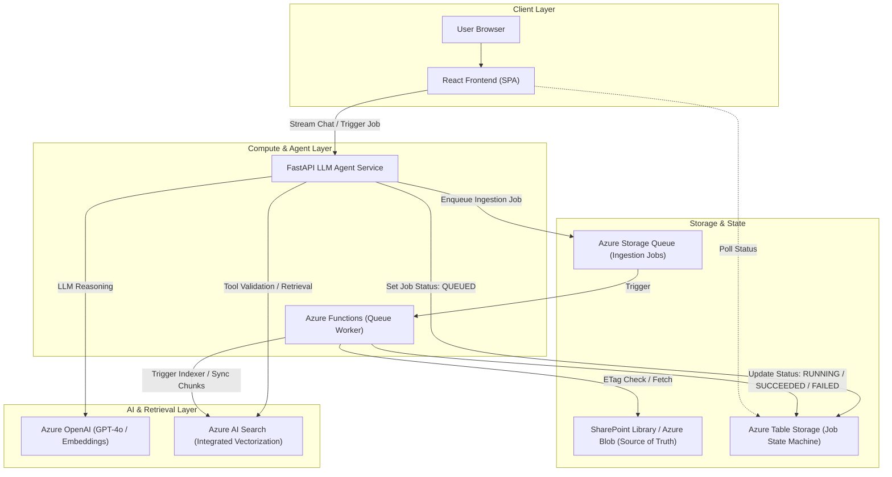

# Architecture & Resource Justification

## 1. System Architecture Diagram

---

## 2. Resource Choices & Justifications (Requirement 3.4)

| Component | Selected Azure Resource | Considered Alternatives | Why Alternatives Were Rejected |
|---|---|---|---|
| **Source of Truth / File Storage** | SharePoint Document Library / Azure Blob Storage | Azure Files, AWS S3 | SharePoint is mandated as the primary source of truth. |
| **API Compute** | Azure Container Apps (FastAPI) | Azure App Service, Azure Functions (HTTP) | Better cold-start characteristics, native containerization, cost-efficient micro-scaling. |
| **Queue & Worker** | Azure Storage Queue + Azure Functions (Python v2) | Azure Service Bus, RabbitMQ, Celery | Storage Queues provide lightweight, highly durable, low-cost at-least-once delivery with native Azure Functions bindings. |
| **Search Tier** | Azure AI Search (Basic/Standard with Semantic Ranker) | Elasticsearch, Pinecone, Qdrant | Native integration with Azure OpenAI & SharePoint data sources, Integrated Vectorization pipeline. |
| **Model Hosting** | Azure OpenAI Service (`gpt-4o`, `text-embedding-3-small`) | Self-hosted vLLM on VMs, OpenAI public API | Enterprise compliance, private networking, data residency, managed SLA. |
| **State / Job Tracking** | Azure Table Storage | Cosmos DB, Azure SQL, Redis | Extremely low cost, key-value schema perfect for PartitionKey/RowKey job status lookups. |
| **Identity & Access** | Microsoft Entra ID (Managed Identities) | API Keys, SAS tokens in code | Zero-secret footprint, role-based access control (RBAC). |
| **Observability** | Azure Application Insights & Log Analytics | Datadog, Prometheus/Grafana | Out-of-the-box distributed tracing across Functions, Container Apps, and Azure SDKs. |
| **Frontend Hosting** | Azure Static Web Apps | Storage Static Websites, Nginx on Container Apps | Global CDN distribution, automated preview environments, native Entra authentication integration. |

---

## 3. Cost Modeling (Requirement 3.5 & 1.10)

### Baseline Load (5,000 PDFs, 200 Chat Sessions/Day)
* **Storage & Operations**: ~$1 - $5/mo
* **Azure AI Search (Basic/Standard S1)**: ~$75 - $250/mo
* **Azure OpenAI (Tokens for Embeddings & Chat)**: ~$15 - $40/mo
* **Compute (Container Apps & Functions Consumption)**: ~$10 - $30/mo
* **Total Estimated Cost**: ~$100 - $350/month

### Scale Factor (100x Scale: 500,000 PDFs, 20,000 Sessions/Day)
* **What breaks first**: Azure AI Search storage partitions/indexer throughput limits; OpenAI TPM (Tokens Per Minute) throttling.
* **Architecture adjustments**: Partitioned search indexes, provisioned throughput (PTU) for OpenAI, dedicated Service Bus queues with partition keys.

---

## 4. Review Questions & Architectural Defenses (Requirement 06)
1. **File updated 3 times in 10 seconds**: ETag/version check handles deduplication; intermediate versions are skipped if superseded before processing.
2. **Trigger path down for 2 hours**: On-demand / scheduled delta catch-up runs reconcile the library state against the search index.
3. **400-page PDF deleted**: Azure AI Search documents tagged with `ParentDocumentID` are purged in bulk using an OData filter.
4. **Prompt injection in PDF**: Strict tool schema validation and separation between retrieval context and agent instruction blocks.

---

## 5. Azure AI Search Pipeline Strategy (Simplified Breakdown)

כל מה שמתבצע בחיפוש (Azure AI Search) מסתכם ב-4 צעדים טכניים ברורים:

* **צעד 1: חיתוך (Chunking)**
  * **מה בוצע:** המערכת חותכת את ה-PDF למקטעים של **400–600 טוקנים** עם חפיפה של **50–100 טוקנים** (~10%–15%) (`SplitSkill`).
  * **למה?** מדידה בטוקנים מדויקת הנדסית (במיוחד בעברית) ומונעת קטיעה סמנטית של משפטים בין סעיפים ותנאים כבולים.

* **צעד 2: הפיכה למספרים (Embedding)**
  * **מה בוצע:** שולחים כל מקטע למודל `text-embedding-3-small` ב-Azure OpenAI ומקבלים וקטור של 1,536 ממדים (`AzureOpenAIEmbeddingSkill`).
  * **למה?** כי הוא זול, תומך בעברית, ומספק יחס עלות-תועלת אופטימלי בדרישות התקציב.

* **צעד 3: זיהוי ומחיקה מלאה (Document Identity & Metadata)**
  * **מה בוצע:** לכל מקטע מצמידים מזהה אב יציב (`ParentDocumentID`) הילוט מול קובץ ה-Source ב-**Azure Blob Storage**.
  * **למה?** כשהקובץ נמחק או מוחלף ב-Blob Storage, ה-Worker מאתר את כל ה-Chunks המשויכים לאותו `ParentDocumentID` ומוחק אותם מהאינדקס באופן מלא ואידמפוטנטי בלי שאריות.

* **צעד 4: חיפוש משולב (Hybrid Search & Reranking)**
  * **מה בוצע:** מחפשים גם לפי מילים מדויקות (BM25) וגם לפי משמעות סמנטית (וקטור), ומריצים Semantic Reranker.
  * **למה?** כי אם מחפשים מק"ט כמו `R-2048`, חיפוש לפי משמעות עלול להתבלבל עם `R-2049`, אבל חיפוש מילים יפגע בול.

