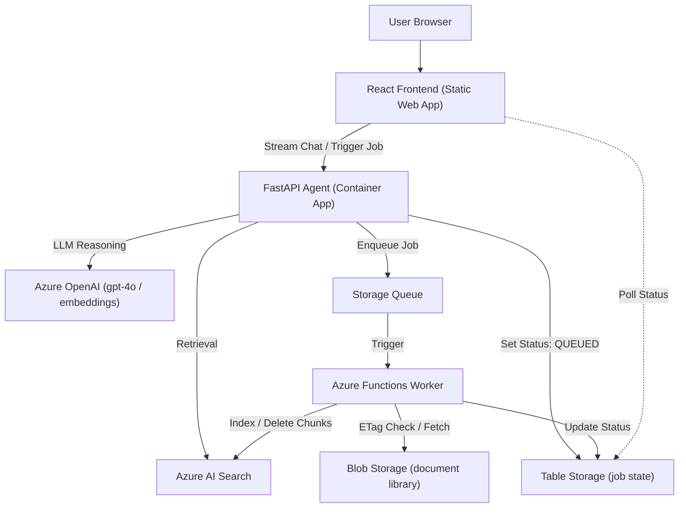

# SharePoint RAG & Agent Platform


An agent that indexes a document library into Azure AI Search and lets users **add, replace, and delete files through conversation** — with citations, background jobs, and no manual re-indexing step.

Take-home exercise. See [`docs/EXERCISE_REQUIREMENTS.md`](docs/EXERCISE_REQUIREMENTS.md) for the brief, [`ARCHITECTURE.md`](ARCHITECTURE.md) for the design and cost model, and [`plan.md`](plan.md) for the ingestion pipeline task breakdown.

---

## Contents

- [Architecture at a glance](#architecture-at-a-glance)
- [Repository layout](#repository-layout)
- [Build status](#build-status)
- [Assumptions](#assumptions)
- [Getting the cloud environment running](#getting-the-cloud-environment-running-infrastructure)
- [Running the backend / worker / frontend](#running-the-backend--worker--frontend)
- [Cost, alternatives, and review-question answers](#cost-alternatives-and-review-question-answers)

---

## Architecture at a glance



Full justification for every resource choice (and the alternatives rejected) lives in [`ARCHITECTURE.md`](ARCHITECTURE.md).

## Repository layout

| Path | Contents |
|---|---|
| [`infrastructure/`](infrastructure/) | Bicep IaC for every Azure resource — reproducible from an empty resource group |
| [`backend/`](backend/) | FastAPI agent service (chat, tool calls, job orchestration) |
| [`worker/`](worker/) | Azure Functions queue worker (indexing, deletion, job state) |
| [`frontend/`](frontend/) | React chat UI |
| [`docs/`](docs/) | Exercise brief |

## Build status

| Layer | Status |
|---|---|
| Infrastructure (Bicep) | ✅ Implemented — deployable end to end |
| Infra CI/CD (`deploy-infra.yml`) | ✅ Implemented (OIDC, no stored secrets) |
| Backend (FastAPI agent) | 🚧 Scaffolded, not yet implemented |
| Worker (Azure Functions) | 🚧 Scaffolded, not yet implemented |
| Frontend (React) | 🚧 Scaffolded, not yet implemented |
| App-level CI/CD | 🚧 Workflow files exist, not yet implemented |

## Assumptions

- **Source of truth**: the brief specifies SharePoint, but a real SharePoint document library and Graph API integration is out of scope for the timebox. Azure Blob Storage stands in behind the same interface the worker and search indexer consume (`worker/services/blob_client.py`), so swapping in a real SharePoint connector later only touches that seam. This is the "document library" referred to everywhere else in this README.
- **Compute**: the backend runs on Azure Container Apps (not App Service) — see the alternatives comparison in `ARCHITECTURE.md`.
- **Triggering**: file changes are driven by the agent's own actions (add/replace/delete requests enqueue a job directly), not by a Blob-change event grid. The backend is the only writer to the document store, so this covers the required freshness/triggering behavior without an extra eventing layer.
- **Region**: `swedencentral` by default (set in `infrastructure/main.bicepparam`) — pick any region with Azure OpenAI model capacity for your subscription.

## Getting the cloud environment running (Infrastructure)

Everything in Azure is defined as code under [`infrastructure/`](infrastructure/) and is reproducible from an empty resource group.

**Prerequisites**: an Azure subscription, [Azure CLI](https://learn.microsoft.com/cli/azure/install-azure-cli) with the Bicep extension (`az bicep install`), and `jq` if you want the generated `.env` hand-off file.

```bash
az login
az account set --subscription "<your-subscription-id>"

cd infrastructure/scripts
chmod +x deploy.sh register-entra-app.sh
./deploy.sh rg-ragpoc-dev swedencentral
```

This provisions, in order: Log Analytics + Application Insights, the storage account (blob container / queue / table), Azure AI Search, Azure OpenAI (`gpt-4o` + `text-embedding-3-small` deployments), the Container Apps environment + backend Container App (placeholder image until CI/CD pushes a real one), the Function App for the worker, and a Static Web App for the frontend. It also wires RBAC role assignments so the backend, worker, and search service authenticate to each other with managed identities — no connection strings or API keys anywhere.

At the end it writes `infrastructure/scripts/.generated.env` (gitignored) with the endpoints/names each app layer needs.

To wire up sign-in:

```bash
./register-entra-app.sh ragpoc-dev https://<your-static-web-app-hostname> http://localhost:5173
```

Then set the printed `entraTenantId` / `entraApiClientId` in `infrastructure/main.bicepparam` and re-run `deploy.sh` so the backend picks them up.

To tear everything down: `az group delete --name rg-ragpoc-dev`.

### Enabling automatic deploys from GitHub Actions

`deploy-infra.yml` logs into Azure via OIDC (no client secret ever generated or stored). Wire it up once:

```bash
./register-github-oidc.sh <your-github-owner>/<your-repo> rg-ragpoc-dev swedencentral dev
```

This creates a dedicated app registration + federated credential trusting this repo, and grants it `Contributor` + `Role Based Access Control Administrator` scoped to just that resource group (not the whole subscription). It prints the three values to add as GitHub Actions secrets (`AZURE_CLIENT_ID`, `AZURE_TENANT_ID`, `AZURE_SUBSCRIPTION_ID`) plus the `AZURE_RESOURCE_GROUP` repo variable — and the `gh` CLI commands to set them directly if you have it authenticated. It also expects a GitHub environment named `dev` to exist (Settings → Environments).

## Running the backend / worker / frontend

Local dev and app-level setup for each service lives in its own folder (`backend/`, `worker/`, `frontend/`) and is still in progress — see each folder's `.env.example` for the configuration it expects once implemented, and `docker-compose.local.yml` for local Azurite emulation.

## Cost, alternatives, and review-question answers

See [`ARCHITECTURE.md`](ARCHITECTURE.md) (resource justification + cost model) and [`LIMITATIONS.md`](LIMITATIONS.md) (what's stubbed, what breaks under load, next steps).
